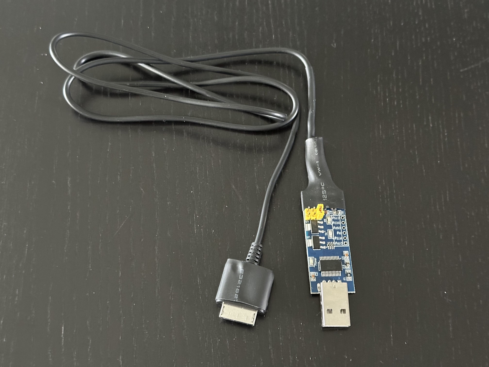
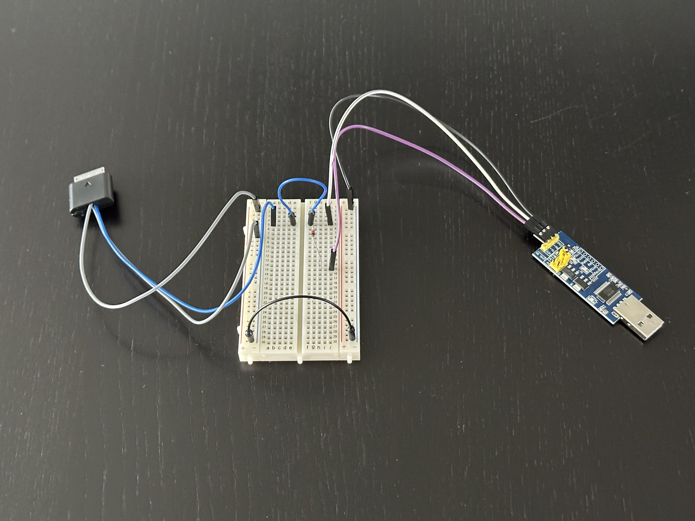
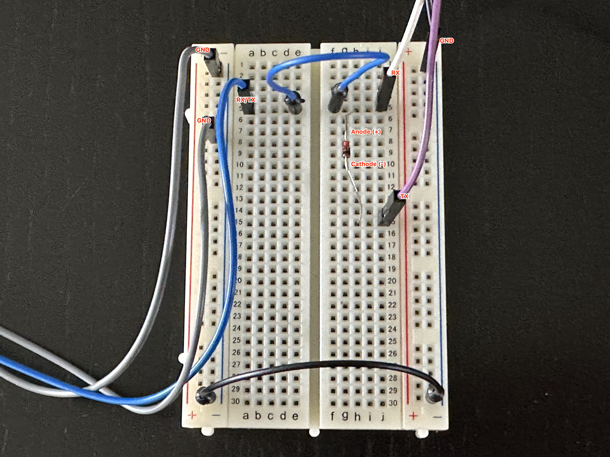
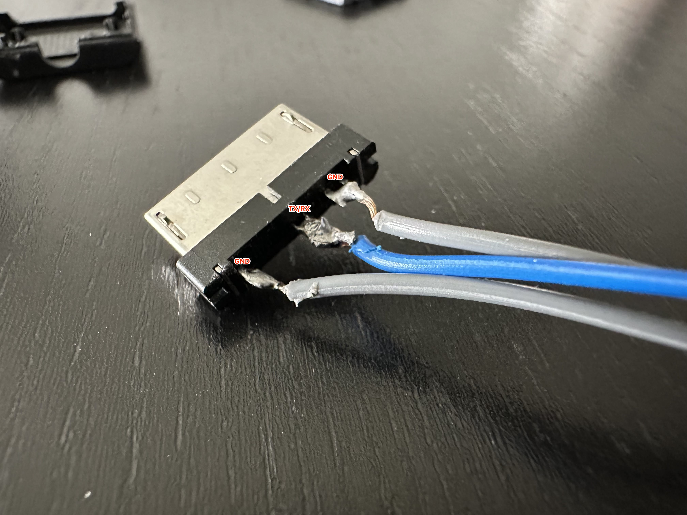
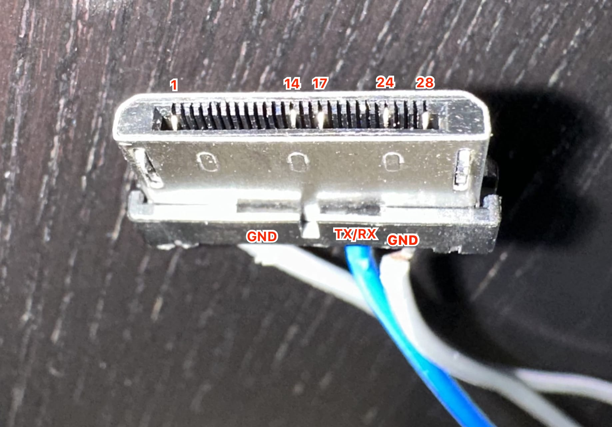
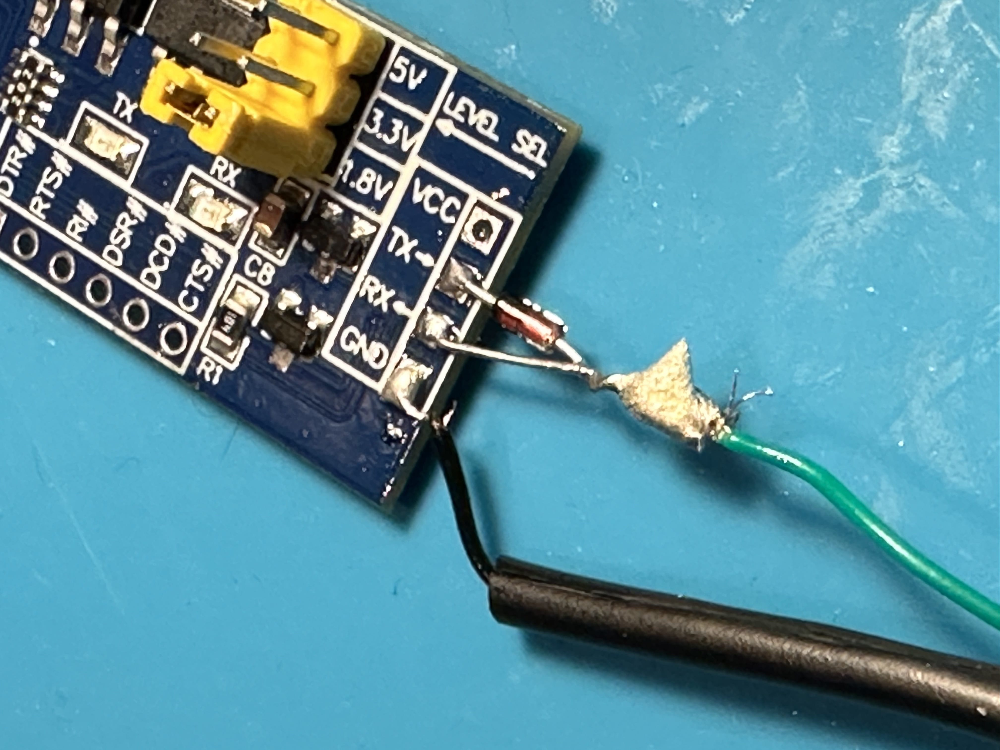

# PSP Go Baryon Sweeper Cable Jig Build Guide

This guide outlines how to build a Baryon Sweeper Jig for the PSP Go.  The main difficulty of this build is that you will need to transplant pins in the cable head and solder fairly fine wire to these small pins.

Thanks to [psdevwiki.com](https://www.psdevwiki.com/psp/Psp_Go_Jigkick) for information.  This guide is just supplementary information for building a cable using the pin information available there.  I take no credit for this, I just figured others out there would like to see more information on building a jig cable to fix their PSP Go.

## Required Parts

* FT232RL USB to TTL Serial Adapter
* 1N4148 Diode
* PSP Go USB Cable (number of pins does not matter)
* Soldering Iron

## Optional Parts

* Breadboard & Jumper Wires

##  Cable Pinout

This cable does not provide power to the PSP Go so you will need a working battery with a charge in it.

The finished cable head will have 5 pins total, here are their numbers and what they are connected to.  For pin order, [see this image](images/breadboard_03.jpeg).

* Pin 1 - GND
* Pin 14 - TX on FT232RL (through 1N4148 diode)
* Pin 17 - RX on FT232RL
* Pin 24 - GND
* Pin 28 - GND

## Build Steps

The following are the steps that I have found worked best for me, I ended up removing the PCB entirely and then reinserting the 5 required pins.  You can build this on a breadboard or solder everything to make a permenant cable.

* Set the FT232RL adapter to 1.8v by moving the jumper or bridging the pins.
* Carefuly pry open the head of the PSP Go cable to access the PCB.
* Grip the PCB and pull it straight out of the [plug head](images/cable_pcb.jpeg).
  * Pay attention to the orientation of the pins as they need to go back in the same orientation.
* Desolder 5 pins off the PCB, take care not to bend them.
* Insert pins back in slots 1, 14, 17, 24 and 28.
  * Make sure you insert them the proper direction, they have a slight curve to them and can easily be flipped.
  * I used the macro photo mode on my phone to assist in this, take a picture and zoom in and count.
* Solder wire to the following pins:
  * Pins 1, 24 and 28 can be connected together, 24 and 28 are close enough to bridge the pins with solder, 1 will need a wire connected over.
  * Pins 14 and 17 can be connected together with a single wire at the cable head end, they will share the same wire with the 1N4148 diode connected inline before connecting 14 to TX.
* Connect the wire from 1/24/28 to the GND on the FT232RL.
* Add the 1N4148 diode to the end of the wire coming from 14/17.
* Connect the Anode (+) side to RX on the FT232RL.
* Connect the Cathode (-) side to TX on the FT232RL.
* From here everything is complete, you can test continuity between everything.
  * TX will only have continuity to the Cathode side of the diode if the diode is working.
  * Everything for using this cable is outlined on the [aiseirigh repo](https://github.com/TheZett/aiseirigh/releases/tag/release).

## Images

[More images are available here](images/).  Most of these pictures are using a breadboard so that connections are easily tracable in photo form. I didn't take many photos before applying the heatshrink on my permanent cable.

## Contact

If you have any questions, feel free to open an issue on this repo or you can reach out on [Mastodon](https://mstdn.ca/@mikegabriel). 